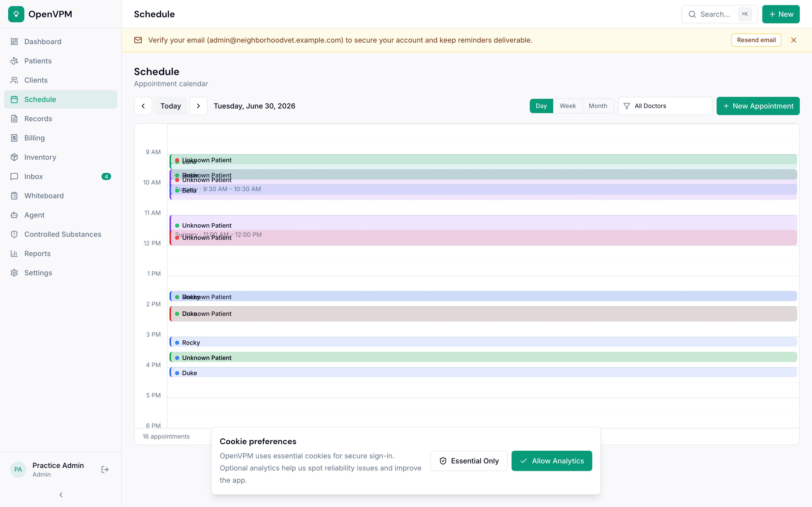
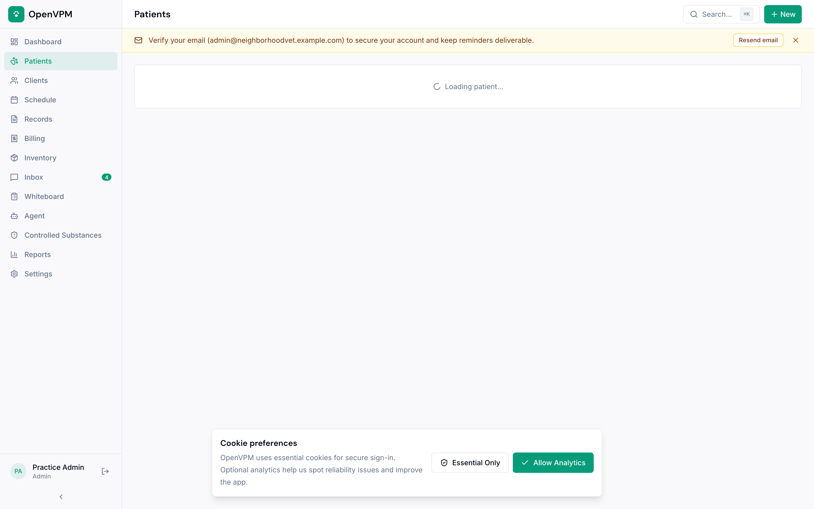

<p align="center">
  
</p>

<h1 align="center">OpenVPM</h1>

<p align="center">
  <strong>The open-source veterinary practice management system the industry has been waiting for.</strong>
</p>

<p align="center">
  <a href="https://demo.openvpm.com/login">Live Demo</a> &middot;
  <a href="https://openvpm.com">Website</a> &middot;
  <a href="#features">Features</a> &middot;
  <a href="#quick-start">Quick Start</a> &middot;
  <a href="#api">API Docs</a> &middot;
  <a href="#contributing">Contributing</a>
</p>

<p align="center">
  <a href="https://github.com/evangauer/openvpm/actions"></a>
  <a href="LICENSE"></a>
  <a href="CONTRIBUTING.md"></a>
  <a href="https://github.com/evangauer/openvpm/discussions"></a>
  <a href="https://github.com/evangauer/openvpm/stargazers"></a>
</p>

---

<p align="center">
  <strong>▶ <a href="https://demo.openvpm.com/login">Try the live demo</a></strong> — one-click logins, no signup. &nbsp;|&nbsp; If you believe veterinary software should be open, <strong><a href="https://github.com/evangauer/openvpm">give us a ⭐</a></strong> — it helps other clinics and builders find the project.
</p>

---

## The Problem

The veterinary PIMS market is broken — and everyone knows it.

**For clinics:** Commercial systems like ezyVet, ProVet Cloud, and Cornerstone charge $200–600+/month, lock you into proprietary data formats, and deliver software that staff describe as "extremely nonuser friendly," "very clunky," with "terrible" financial reporting and support that declines after the sale closes. Legacy systems crash. Modern ones charge extra for texting. Every one of them holds your data hostage.

**For innovators:** AI agents are poised to disrupt the PIMS as the "system of record" — but only if there's an open system to build on. Today, most PIMS have closed or poorly documented APIs, making it nearly impossible for AI tools, voice agents, or third-party developers to read and write patient data. There is no widely adopted data interoperability standard in veterinary medicine.

**The open-source gap:** OpenVPMS is Java-based, dated, and primarily Australian-focused. A few student projects exist on GitHub but none are production-ready. Until now, there has been **no modern, well-designed, open-source PIMS with an open API.**

OpenVPM fills that gap.

## What is OpenVPM?

OpenVPM is a modern, cloud-native veterinary practice information management system that is:

- **Beautiful and intuitive** — Practice managers and front desk staff should be productive within a single shift, not a multi-week training program
- **API-first** — Dashboard workflows use typed tRPC procedures, while external integrations use scoped `/api/v1` REST endpoints and signed webhooks for supported read/write workflows
- **Cloud-native but self-hostable** — Run it on our cloud or deploy it on your own infrastructure
- **Free and open source** — AGPLv3, forever. No per-provider pricing. No vendor lock-in. Your data is yours.

> _"I would need to see the product benefit us by reducing our staff hours."_
> — A practice manager we interviewed during research

That's the bar we're building to.

## Screenshots

| Dashboard                                    | Schedule                                   | Patient Record                           |
| -------------------------------------------- | ------------------------------------------ | ---------------------------------------- |
|  |  |  |

## Help & Guides

Short, plain-language guides live in [docs/help](docs/help/README.md): getting started, the day sheet, the AI helper, client portals, calendar sync, and owning your data. Before evaluating OpenVPM for live clinic use, read the [Clinic Pilot Readiness Guide](docs/clinic-pilot-readiness.md) for the current supported, configuration-dependent, and not-yet-supported boundaries. Switching from another PIMS? Start with [Migrating to OpenVPM](docs/migrating-to-openvpm.md).

## Features

### Phase 1 — Foundation (Implemented)

**Patient & Client Management**
Complete patient records with species, breed, weight history with trend charts, microchip tracking, photo uploads, and allergy/reaction alerts. Multi-pet households linked to single clients. Instant fuzzy search across all records via Cmd+K.

**Appointment Scheduling**
Visual calendar with day/week views and column-per-doctor layout. Configurable appointment types with durations and colors. Doctor-specific vs. any-doctor scheduling. Full status flow: Scheduled > Checked In > In Exam > Checked Out. Recurring appointments and block scheduling.

**Electronic Medical Records (EMR)**
SOAP notes with rich text editing. Problem lists (active/resolved/chronic). Vaccination records with reminders and certificate generation. Lab results viewer with reference ranges and trend graphs. Prescription management with dosing calculator and refill tracking. Document and image attachments.

**Billing & Invoicing**
Treatment templates can populate draft invoices, with itemized manual service/product line items, tax calculation, estimates that convert to invoices, payment tracking, account balances, and revenue reporting.

**Inventory Management**
Product catalog with stock levels, reorder point alerts, lot/batch tracking, and expiration dates. Auto-deduction when products are dispensed from invoices or EMR prescriptions. Supplier contact management for reorder workflows.

**Controlled Substance Tracking**
Controlled-substance logging with patient and lot linkage, running balances,
waste-witness fields, and full audit trails. Practices should validate the
configured workflow against their federal, state, and local procedures.

### Phase 2 — Communication & Intelligence (Core implemented; delivery services require configuration)

**Client Communication Hub**
Communication history across calls, texts, emails, and inbound portal requests. Appointment and vaccination reminder workflows are administrator-controlled, and email delivery requires a configured provider. Hosted SMS and two-way texting are a controlled, one-location clinic pilot that requires carrier activation and recorded client consent. General-purpose bulk marketing campaigns are not included.

**Practice Whiteboard**
Shared, auto-refreshing patient status board showing patient name, doctor, room, status, time in, procedure, and notes across clinic workflows.

**Reporting & Analytics**
Dashboard with KPI cards, revenue trends, appointment utilization, species distribution, and production by doctor. Exportable to CSV/PDF.

**Client Portal**
Pet owners can view health records, request appointments, download vaccination certificates, view invoices, pay online when Stripe checkout is configured, and see active prescriptions.

### Phase 3 — API & AI (Implemented; AI requires a configured model provider)

**Open API**
Versioned `/api/v1` REST API for external integrations, with API reference documentation. Webhook system for real-time events (appointment created, patient checked in, invoice paid). API key management with scopes and rate limiting. Audit logging.

**AI-Ready Architecture**
Structured data models queryable by AI agents. Signed webhook events for agent subscriptions. Integration points for SOAP note generation, appointment booking, checked-in appointment events, and hosted agent runs.

## Tech Stack

| Layer            | Technology                                                         |
| ---------------- | ------------------------------------------------------------------ |
| **Frontend**     | Next.js 15 (App Router), TypeScript, React 19                      |
| **UI**           | shadcn/ui + Radix UI + Tailwind CSS                                |
| **API**          | tRPC dashboard API + versioned `/api/v1` REST                      |
| **Database**     | PostgreSQL 16 + Drizzle ORM                                        |
| **Auth**         | NextAuth.js (role-based clinic access, including read-only Viewer) |
| **Events**       | Signed webhook delivery for integrations                           |
| **Email/SMS**    | Resend + Telnyx SMS (Twilio fallback)                              |
| **Payments**     | Stripe                                                             |
| **File Storage** | S3-compatible (MinIO for self-hosted)                              |
| **Monorepo**     | Turborepo + pnpm workspaces                                        |
| **Testing**      | Vitest + Playwright                                                |
| **Deployment**   | Docker Compose (self-host) or Vercel (cloud)                       |

## Architecture

```
openvpm/
├── apps/
│   ├── web/                    # Next.js frontend + API
│   │   ├── app/                # App Router pages
│   │   │   ├── (auth)/         # Login, register
│   │   │   ├── (dashboard)/    # Main clinic workflows
│   │   │   └── portal/         # Client-facing portal
│   │   ├── components/         # UI component library
│   │   ├── lib/                # Utilities and integrations
│   │   └── server/             # tRPC routers and server services
│   └── docs/                   # Documentation workspace metadata
├── docs/                        # Help, API, deployment, and safety guides
├── packages/
│   ├── db/                     # Modular schema, migrations, RLS, seed data
│   ├── api/                    # Shared Zod validators
│   ├── config/                 # TypeScript, Tailwind config
│   └── email/                  # Email templates
├── docker/                     # Docker Compose (PostgreSQL + MinIO)
└── e2e/                        # Playwright E2E tests
```

### Database Design

Modular schemas cover core clinical, scheduling, billing, inventory, communication, consent, migration, and operational records. Clinic-owned rows use explicit practice relationships and are protected by tenant-scoped application access plus database row-level security policies. Structured relational records are used for the primary clinic entities; JSON fields are reserved for bounded settings, event payloads, and immutable snapshots where their shape is explicitly managed.

### API Coverage

Dashboard tRPC routers cover the product's clinic workflows, including patients, clients, appointments, encounters, records, billing, inventory, communications, reporting, portal access, settings, and administration. Dashboard procedures include Zod validation and role-based access control through tRPC. External integrations use the smaller, scoped, API-key authenticated `/api/v1` REST surface documented below; dashboard router coverage does not imply equivalent public REST coverage.

### Security

- **Multi-tenancy:** Tenant-scoped application queries plus database row-level security for clinic-owned data
- **RBAC:** Admin, Veterinarian, Technician, Front Desk, and read-only Viewer roles enforced at the API layer
- **Auth:** NextAuth.js with bcrypt password hashing and database sessions
- **Headers:** CSP, HSTS, Permissions-Policy, X-Content-Type-Options, X-Frame-Options, X-XSS-Protection, Referrer-Policy
- **Audit:** Audit records for security-sensitive and high-risk clinical and financial workflows; coverage is expanded as workflows mature

## Quick Start

### Prerequisites

- Node.js 20+
- pnpm 9+
- Docker (for PostgreSQL and MinIO)

### Setup

```bash
# Clone the repository
git clone https://github.com/evangauer/openvpm.git
cd openvpm

# Copy environment config
cp .env.example .env

# Start PostgreSQL and MinIO
docker compose -f docker/docker-compose.yml up -d

# Install dependencies
pnpm install --frozen-lockfile

# Verify this clone contains only public release material
pnpm verify:oss-release

# Apply database schema
pnpm db:push

# Apply and verify row-level security policies
pnpm db:rls
pnpm db:rls:test

# Seed with realistic demo data
pnpm db:seed

# Start the development server
pnpm dev
```

Open [http://localhost:3000](http://localhost:3000) and sign in with the demo credentials:

| Role         | Email                                     | Password    |
| ------------ | ----------------------------------------- | ----------- |
| Admin        | admin@neighborhoodvet.example.com         | password123 |
| Veterinarian | sarah.chen@neighborhoodvet.example.com    | password123 |
| Technician   | jamie.torres@neighborhoodvet.example.com  | password123 |
| Front Desk   | morgan.bailey@neighborhoodvet.example.com | password123 |

The seed data creates a complete demo practice — "Neighborhood Veterinary" — with 8 staff, 25 clients, 40 patients, 2 weeks of appointments, SOAP notes, vaccination records, invoices, and 50 inventory products.

The Docker Compose stack includes a one-shot MinIO bootstrap container that creates the `openpims` bucket used by `S3_BUCKET`. When using an external S3-compatible store, create that bucket yourself and grant the app credentials read/write/delete/head access before uploads, backups, or file previews run.

Before using a self-hosted installation with real clinic data, complete the
[open-source release checklist](docs/open-source-release-checklist.md) and the
[clinic pilot readiness guide](docs/clinic-pilot-readiness.md). A successful
local build is not, by itself, a production-readiness assessment.

### Deploy with Docker

```bash
docker compose -f docker/docker-compose.yml up -d
```

The Docker setup includes PostgreSQL 16 with health checks, MinIO for S3-compatible file storage, automatic MinIO bucket bootstrap, and a multi-stage production build of the web application. For production, run `pnpm db:migrate`, then `OPENPIMS_APP_DB_PASSWORD='<strong>' pnpm db:rls`, verify with `OPENPIMS_APP_DB_PASSWORD='<same>' pnpm db:rls:test`, and point the app at the generated least-privilege `openpims_app` database role before serving traffic.

## API

OpenVPM is **API-first**: dashboard workflows use typed tRPC procedures, while third-party integrations use scoped `/api/v1` REST endpoints and signed webhooks for supported read/write workflows.

### REST API (v1)

A versioned, public REST API over the core records, authenticated with scoped API keys — built so integrators (booking, reminders, client comms, AI agents, and AI scribes) can read clients/patients/appointments, create appointments, create SOAP notes, and run the agent without touching the internal client. Response shapes are owned by an explicit contract and frozen independently of the database, so internal changes never break integrations.

```bash
curl https://demo.openvpm.com/api/v1/clients \
  -H "Authorization: Bearer ovpm_…"
```

See [docs/api](docs/api/README.md) for endpoints, scopes, rate limits, and the error format. This namespace can also serve as the foundation for vendor-compatibility adapters, but each incumbent API requires its own mapping and validation work.

### Webhooks

Subscribe to real-time events:

```json
{
  "url": "https://your-app.com/webhook",
  "events": [
    "appointment.created",
    "appointment.checked_in",
    "appointment.rescheduled",
    "appointment.cancelled",
    "patient.created",
    "invoice.paid"
  ]
}
```

Payloads are signed with HMAC-SHA256 and delivered with exponential backoff retry.

### API Keys

Scoped API keys with rate limiting and audit logging. Create keys via the Settings panel or the API itself.

### For AI Developers

OpenVPM's structured data models and signed webhook events make it the ideal foundation for veterinary AI:

- **Automation and voice agents** can create appointments and run the OpenVPM Agent through scoped API-key endpoints
- **AI scribes** can write SOAP notes directly into the medical record
- **Webhook subscribers** can react to appointment, patient, invoice, and SOAP-note events
- **Reminder systems** can use current clients/patients/appointments endpoints and signed events, with broader campaign APIs tracked as explicit roadmap work

The PIMS is the system of record. AI agents are first-class citizens.

### OpenVPM Agent

OpenVPM ships with a built-in AI agent that operates on practice data through a typed tool layer (find clients/patients, pull a clinical summary, list overdue vaccinations, calculate a weight-based drug dose, book appointments). It runs a provider-agnostic tool-use loop scoped to a single practice, gates every write behind an explicit opt-in, and degrades gracefully when no matching model key is set. Choose the model with `AI_MODEL` and bring your own `GOOGLE_API_KEY` or legacy `GOOGLE_GENERATIVE_AI_API_KEY` for Gemini, or `ANTHROPIC_API_KEY` for Claude. Available in-app under **Agent** and via the `agent` tRPC router plus `/api/v1/agent`.

## OpenVPM Cloud

Self-hosting stays fully unlocked and free. Leave `HOSTED_BILLING_ENABLED` unset and OpenVPM runs without Stripe gates, hosted metering, or paid-plan limits.

OpenVPM Cloud is the hosted service for clinics that do not want to run infrastructure. It includes a 14-day free trial with no credit card required — clinics land in the product immediately and add a card only to convert, then bills one simple plan:

- $79/month per active, non-deleted location, with unlimited staff (all roles included)
- $790/year per active location (two months free), with unlimited staff
- Included monthly AI allowance and, for activated texting pilots, an SMS allowance; configured overages use Stripe meters
- Enterprise deployments are custom/contact-sales

Hosted Stripe setup uses monthly and annual recurring per-location prices in `STRIPE_PRICE_CLOUD_LOCATION` and `STRIPE_PRICE_CLOUD_LOCATION_ANNUAL`. Checkout contains one customer-facing OpenVPM Cloud line item. `STRIPE_PRICE_CLOUD_USER` and `STRIPE_PRICE_CLOUD` are legacy-only for existing subscriptions and are not used for new checkout.

For hosted deployment details, see [docs/hosted-cloud-production.md](docs/hosted-cloud-production.md).

## Why Open Source Matters for Veterinary Medicine

The veterinary industry is at a crossroads. AI is arriving. Data interoperability is becoming critical. And the dominant PIMS vendors are still charging hundreds per month for software that crashes, frustrates staff, and locks clinics into proprietary ecosystems.

Open source changes the equation:

- **Clinics own their data.** Export everything, any time. No lock-in, period.
- **The community drives the roadmap.** Features are built because practices need them, not because a sales team prioritized them.
- **AI builders can innovate.** An open API and structured data models mean the next generation of veterinary AI tools can be built on a foundation that actually works.
- **Software license cost can go to zero.** Self-hosted OpenVPM is free software; clinics still own their infrastructure, operations, messaging, payment, and integration costs.

We believe the best software for veterinary medicine should be built _with_ the veterinary community, not sold _to_ it.

## Contributing

We welcome contributions from developers, veterinary professionals, and anyone who believes in open-source healthcare software.

See [CONTRIBUTING.md](CONTRIBUTING.md) for development setup, coding standards, and how to submit pull requests.

### Areas Where We Need Help

- **Veterinary domain expertise** — Help us get the clinical workflows right
- **UI/UX design** — Help us make every screen intuitive
- **Integrations** — Lab equipment (IDEXX, Abaxis), payment processors, telemedicine
- **Internationalization** — Help us support practices worldwide
- **Testing** — E2E tests, integration tests, accessibility audits
- **Documentation** — API guides, deployment tutorials, user manuals

## Roadmap

See **[ROADMAP.md](ROADMAP.md)** for what's shipping now, next, and later — and how to influence it.

- [x] Patient & client management
- [x] Appointment scheduling with calendar views
- [x] Electronic medical records (SOAP, manual/in-house lab results, vaccinations, prescriptions)
- [x] Billing & invoicing
- [x] Inventory management with reorder alerts
- [x] Controlled substance tracking
- [x] Client communication history, portal requests, and configured email workflows
- [x] Auto-refreshing shared practice whiteboard
- [x] Reporting & analytics dashboard
- [x] Client portal
- [x] Open API with webhooks
- [x] AI integration points
- [x] Public REST API (`/api/v1`) with scoped API keys
- [x] OpenVPM Agent — query practice data and make supported, explicitly opted-in writes
- [x] Drug dosing calculator, vital signs, treatment plans
- [x] Wellness plans / recurring billing
- [x] Online appointment requests with staff confirmation (client portal and public booking page)
- [x] CSV import for migrating clients & patients
- [ ] Online booking widget (embeddable)
- [ ] Hosted SMS rollout beyond the controlled, one-location clinic pilot
- [ ] FHIR-inspired veterinary data standard
- [ ] Multi-language support
- [ ] Mobile companion app
- [ ] Telemedicine integration
- [ ] Advanced AI features (auto-coding, predictive analytics)

## Community

- **Website:** [openvpm.com](https://openvpm.com)
- **GitHub Discussions:** [Join the conversation](https://github.com/evangauer/openvpm/discussions)
- **Email:** hello@openvpm.com

## License

**GNU AGPLv3** — see [LICENSE](LICENSE) for the full text.

Free to use, run, self-host, modify, and share. Your clinic owns its data and can export it any time — no lock-in, ever. The only obligation: if you run a **modified** version as a network service, share your changes under the same license (the AGPL "network use" clause).

Need different terms — e.g. to embed OpenVPM in a closed-source product or offer a modified hosted service without the AGPL obligations? A **commercial license** is available. Reach out.

---

<p align="center">
  <strong>Built for the veterinary community, by people who believe great software should be accessible to every practice.</strong>
</p>
